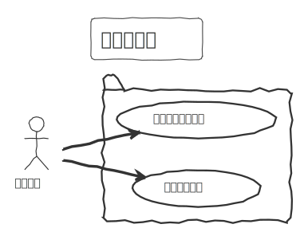
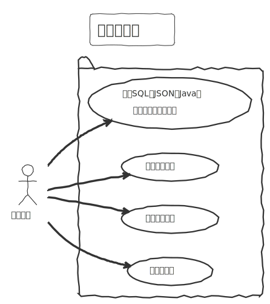

# 项目简介

用例图：

<p align="center">
  
  <br/>
</p>


<p align="center">
  
  <br/>
</p>


架构图：

<p align="center">
  
  <br/>
</p>


涉及技术

- Spring Cloud Alibaba
  - Nacos
  - Gateway

- Seata
- Redis
- RabbitMQ
- Knife4j
- MyBatis-Plus

服务汇总

| 服务名     |                | 端口号     | 版本号 | 类别     |
| ---------- | -------------- | ---------- | ------ | -------- |
| 数据库     | MySQL          | 3306       | v8     | 环境依赖 |
| 缓存       | Redis          | 6379       | v6     | 环境依赖 |
| 注册中心   | Nacos          | 8848       | v2.2.0 | 环境依赖 |
| 消息队列   | RabbitMQ       | 5672       |        | 环境依赖 |
| 分布式事务 | Seata          | 8091、7091 | v2.0   | 环境依赖 |
| 文档服务   | knife4j-module | 8499       | java8  | 业务服务 |
| 网关服务   | gateway-module | 8500       | java8  | 业务服务 |
| 用户服务   | user-module    | 8501       | java8  | 业务服务 |
| SQL服务    | sql-module     | 8502       | java8  | 业务服务 |
| 字段服务   | field-module   | 8503       | java8  | 业务服务 |
| 词典服务   | dict-module    | 8504       | java8  | 业务服务 |
| 举报服务   | report-module  | 8505       | java8  | 业务服务 |
| 表格服务   | table-module   | 8506       | java8  | 业务服务 |


此项目为sql-father-backend-public的微服务版本

原项目地址：[liyupi/sql-father-backend-public: 新项目：快速生成 SQL 和模拟数据的网站（Java 后端），大幅提高开发测试效率！by 程序员鱼皮 (github.com)](https://github.com/liyupi/sql-father-backend-public)

项目结构参考：[blog-aurora/aurora-blog: 🔥Aurora博客是一个基于Spring Cloud Alibaba的多人微服务博客项目，前台和后台界面非常漂亮，特征：邮箱链接验证、账户锁定等邮件功能。前端技术：TypeScript + Vue3 + Pinia + NaiveUi，后端技术：Spring Cloud Alibaba + RabbitMq + Seata + Oauth2。 (github.com)](https://github.com/blog-aurora/aurora-blog)

# 运行

网关地址：http://localhost:8500/

文档地址：http://localhost:8500/doc/doc.html，http://localhost:8499/doc.html

nacos：http://localhost:8848/nacos

RabbitMQ管理页面：http://localhost:15672/

Seata控制台：http://localhost:7091/

- 查看日志

```
docker service logs sql-father-cloud_gateway-module -f
```


## Docker单机

docker/stand-alone里保存着docker compose构建文件

- 安装docker、maven
- 进入项目文件夹

```sh
cd sql-father-cloud
```

- maven打包

```
mvn clean package
```

- docker运行环境配置

```sh
docker compose -f docker-swarm.env.yml build # 构建
docker compose -f docker-swarm.env.yml up -d # 运行
```

- mysql中nacos数据恢复，包括命名空间、各中间件配置
- docker运行服务

```sh
docker compose -f docker-swarm.service.yml build # 构建
docker compose -f docker-swarm.service.yml up -d # 运行
```


## Swarm集群

- 创建网络

```bash
docker network create --driver overlay --subnet=192.168.0.0/24 --gateway=192.168.0.254 mynetwork
```

- 环境运行

```bash
docker stack deploy -c docker-swarm.env.yml sql-father-cloud
```

- 业务镜像构建

```
docker compose -f docker-swarm.service.yml build
```

- 业务运行

```
docker stack deploy -c docker-swarm.service.yml sql-father-cloud
```


# 项目结构

```
sql-father-cloud
├── mysql-init                   // mysql数据库初始化
├── seata-config                 // seata服务启动配置
├── sql-father-api               // 远程服务的接口
│   ├── dict-api
│   ├── field-api
│   └── user-api
├── sql-father-common            // 各类服务的实体、常量、注解等
│   ├── base-common              // 基础功能
│   ├── core-common              // 核心功能
│   ├── dict-common
│   ├── field-common
│   ├── report-common
│   ├── sql-common
│   ├── table-common
│   └── user-common
├── sql-father-modules           // 服务主体
│   ├── dict-module
│   ├── field-moduel
│   ├── gateway-module
│   ├── knife4j-module
│   ├── report-module
│   ├── sql-module
│   ├── table-module
│   └── user-module
├── sql-father-service           // 业务逻辑，数据库交互
│   ├── dict-service
│   ├── field-service
│   ├── report-service
│   ├── sql-service
│   ├── table-service
│   └── user-service
├── sql-father-starter                   // 各种组件配置类
│   ├── sql-father-knife4j-starter
│   ├── sql-father-mybatis-starter
│   ├── sql-father-nacos-starter
│   ├── sql-father-redis-starter
│   └── sql-father-spring-starter
└── support
    └── support-service
```

# 模块

## 用户模块(User)

用户注册、登录、注销、获取。


## SQL模块(SQL)

根据表信息、字段信息、选择的词典生成对应的代码

sql-father-redis-starter：redis实现分布式session

利用工厂模式封装不同种类的生成算法。包括以下几种生成算法：


## Table模块

数据库存储着用户的创建的表


## 字段模块

存储用户创建的字段信息

## 词典模块


## 举报模块

# 功能模块

## 网关模块

gateway

## 文档模块

http://localhost:8500/doc/doc.html

knife4j


本地运行的是springboot程序进行访问，而在容器时运行的是公开容器，覆盖配置文件。

# 核心功能

不同的SQL数据库的语法规则有略微差距，称之为sql方言，这里设计工厂模式生成不同的方言类，再采用双重校验锁设计工厂，可以保证方言类都是单例。

## SQL代码生成

原单体项目核心类为 GeneratorFacade，门面模式，统一生成，集中数据的生成器。它根据表信息生成所有类型代码，返回实体类GenerateVO，包括SQL语句、java实体代码、typescript接口代码，并且都有相应的数据模拟代码。另外有两个方法分别用于验证表概要和字段。主要问题是核心方法里某个数据模拟类，参杂对其它表的查询。耦合词典服务，调用去查询词典数据库。

为解耦服务，有两个方法一是该生成类做成微服务，提供接口给其它微服务调用。二是做成模块，导入到各自微服务调用。这里采用的是做成模块提供给微服务采用。

DictDataGenerator 类是模拟数据生成的其中方法之一，需要去查询词典数据库。查看代码发现只使用了词典的content字符串，现改造成在controller层预处理所有的field，远程调用词典方法获取词典，将mockparam修改成词典的content，DictDataGenerator 直接使用mockparam。

TableSchemaBuilder 表概要生成器，里面`buildFromAuto`方法需要去查询字段数据库，该方法根据名称模糊查询字段数据库。现改造成在controller层远程调用字段服务获取字段数据，再传入字段到`buildFromAuto`中。


# 数据备份

nacos数据备份，

# 权限系统


# 遇到的问题

1. 微服务的划分和细粒度
   - 采取根据表进行划分
   - 
2. 一些核心功能类调用service查询数据库


子模块中的文件读取问题


mapper包需要固定位置

父模块和依赖模块问题

父模块和依赖模块的依赖都会引入

groupID设置的问题

common,starter->service->module->

common->api
